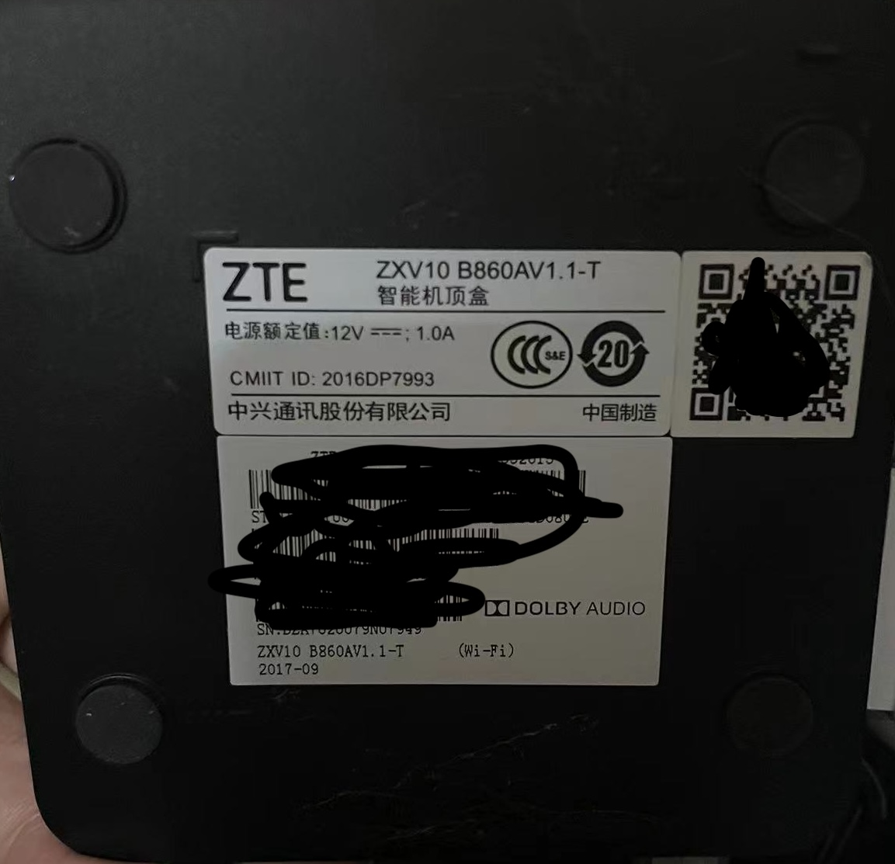
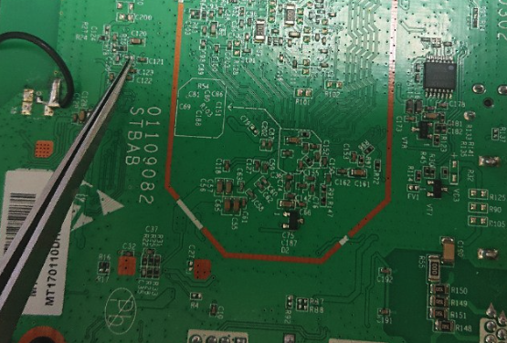

# 中兴B860AV1.1T

## 盒子型号

- 中兴B860AV1.1T
- S905L
- EMMC颗粒内存
- 1+8G

## 刷机过程

### 一、准备
1. USB双公头刷机线
2. 镊子
3. 8G以上的U盘
4. 刷机环境（WIN11）

### 二、刷Android底包
1. 软件准备（安卓底包、晶晨线刷工具）
2. 打开晶晨线刷工具（usb-image-tool-1-70-en-win）加载安卓底包（20191218-R3300L-6.0-root-twrp-Milton），点击开始（右侧可勾选可不勾选）
3. 用镊子短接c125，USB接入盒子（靠近电源的USB口）
4. 进入盒子开启adb（默认开启，默认root）

### 三、刷入Armbian
1. 软件准备（开心电视助手、balenaEtcher、armbian系统）
2. 用balenaEtcher（balenaEtcher-Setup-1.18.11）把U盘刷入armbian（Armbian_20.10_Arm-64_buster_current_5.9.0.img）
3. 修改U盘里的/boot分区的/extlinux/extlinux.conf，在meson-gxl-s905x-p212.dtb那一行去掉#，下面的APPEND也去掉#，其余行数前面加#号，修改u-boot-s905x-s912为u-boot.ext
3. 重启电视盒子的同时插入U盘，进入armbian系统（默认密码root/1234）
4. ssh执行/root/install-aml.sh（写入EMMC）

## 注意事项
* 刷安卓底包时只需要连接USB口
* 插入U盘没反应，插usb3.0的口 供电不然不足
* 如果开心电视助手（开心电视助手4.0测试版by剑心）连不上或者开启不了adb，可以用安卓卡载系统apk（切换卡载系统V1.1.20180808.apk）切换U盘启动
* 刷底包时进度到8%才松开镊子

