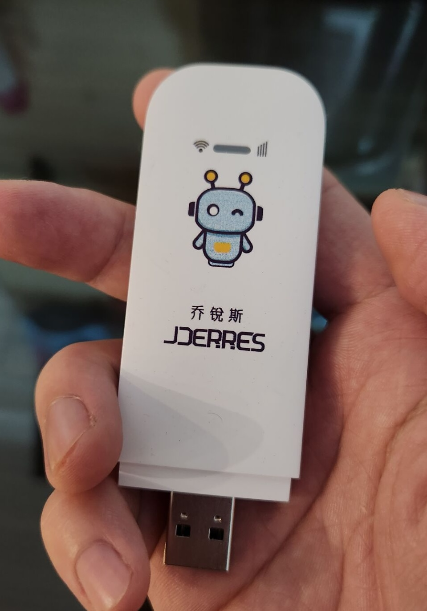

# 乔锐斯高通410-JZ02_V10

## 盒子型号

- 高通410（msm8916）
- JZ02_V10
- 512M + 4G

## 刷机过程

### 一、准备
1. 螺丝刀
2. 刷机环境（WIN11）

### 二、备份
1. 软件准备（随身wifi助手、QPT）
2. 通过随身wifi助手进入9008模式或者adb连接后在终端输入adb reboot edl进入9008模式
3. 随身wifi插入刷机环境，通过miko全量备份（随身wifi助手里面有），read - partition backup - load partition structure - 等待success - 勾选所有 - read full image - 等待success - 保存bin
4. 拔出随身wifi再次插入再次进入9008模式，打开QPT，首先激活QPT，打开keygen生成一个key，在QPT里面点开help - activate输入key，激活成功，依次选择qualcomm - partition - scan - do job - 等待process pass - 勾选backup all - do job（备份分区完成）

### 三、刷入OpenWrt
1. 软件准备（aboot、ufi001c的op系统）
2. 再次用上面的方法进入9008模式，打开QPT，依次选择qualcomm - partition - scan - do job - 等待process pass - 选择aboot - 点击write - do job - 选择emmc_appsboot-test-signed.mbn刷入 - 选择boot - 选择format - do job - 重新插入随身wifi
3. 打开ufi001c的包里面的flash.bat按照提示刷入

镜像来自: [ufi001c-openwrt](https://www.kancloud.cn/a813630449/ufi_car/2792820)

### 四、连接随身wifi
1. 插入刷机环境
2. 进设备管理器，ADB右键，更新驱动，选择从计算机列表中选取，选择Composite USB Device。
3. 重新插入设备，设备管理器出现一个未知的设备，右键更新驱动，从计算机列表选取，选网络适配器，选Microsoft，再选基于远程NDIS的internet共享设备。

## 注意事项
* 刷入后led灯不会亮
* 若误改开不了机接不上，可以按着打开后盖里面的一个按钮接入刷机环境进入9008再重新刷机
* 此型号默认情况下需要激活才能用wifi
* 只有一个频段的网卡（2.4Ghz）不能既作为client又作为master

