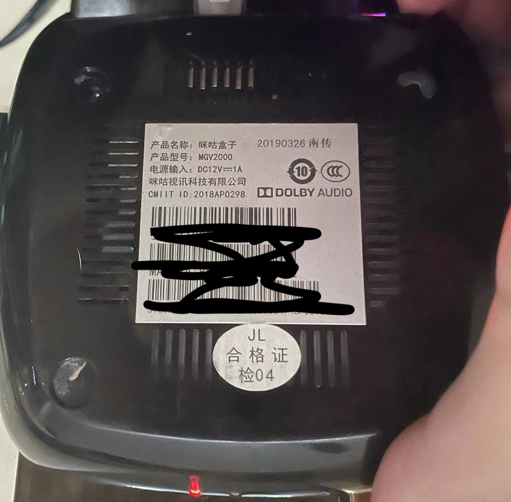
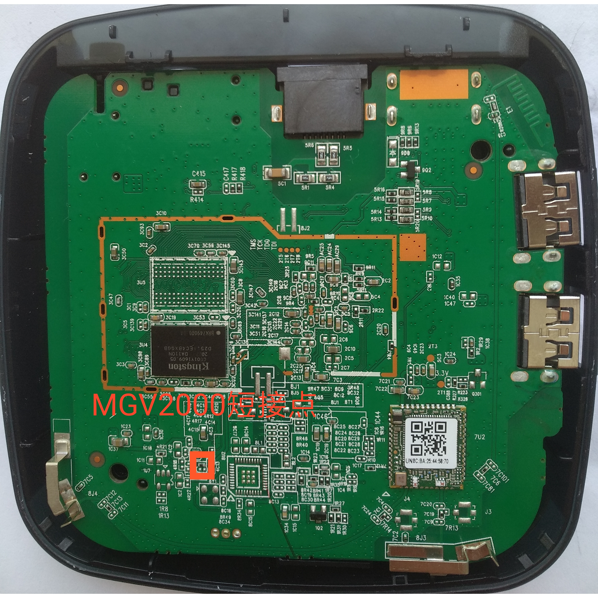

# 咪咕盒子MGV2000-JL

## 盒子型号

- 咪咕盒子MGV2000-JL（南传）
- S905L3-B
- EMMC颗粒内存
- MT7668网卡
- 1+8G

## 刷机过程

### 一、准备
1. USB双公头刷机线
2. 镊子
3. 8G以上的U盘
4. 刷机环境（WIN11）

### 二、刷Android底包
1. 软件准备（安卓底包、晶晨线刷工具）
2. 打开晶晨线刷工具（晶晨USB_Burning_Tool_v2.0.5.15-build9）加载安卓底包（android_tv_mgv2000-s905l3b_and_hg680-lc-s905l3_v9），点击开始（右侧可勾选可不勾选）
3. 用镊子短接（如图），USB接入盒子（靠近电源的USB口）
4. 进入盒子开启adb（默认开启，默认root）

### 三、刷入Armbian
1. 软件准备（开心电视助手、balenaEtcher、armbian系统）
2. 用balenaEtcher（balenaEtcher-Setup-1.18.11）把U盘刷入armbian（Armbian_23.11.0_amlogic_s905l3_bullseye_5.15.137_server_2023.11.01.img.gz）
3. 修改U盘里的boot里面的
3. 有线连接，通过开心电视助手重启电视盒子的同时插入U盘，进入armbian系统（默认密码root/1234）
4. ssh执行armbian-install写入emmc

镜像来自: [amlogic-s9xxx-armbian](https://github.com/ophub/amlogic-s9xxx-armbian)

## 注意事项
* 刷安卓底包时只需要连接USB口
* 插入U盘没反应，插usb3.0的口 供电不然不足
* 启动armbian时无线用不了，只能有线进行连接
* 没有hdmi输出
* 刷底包时进度到8%才松开镊子

